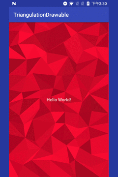

# Triangulation Drawable
[](http://www.apache.org/licenses/LICENSE-2.0.html) [](https://jitpack.io/#nekocode/TriangulationDrawable)

The code of triangulation animation is ported from the **[SVG triangulation (JavaScript)](https://codepen.io/zessx/pen/ZGBMXZ)**.



(Gif Picture)


## Getting started

In your `build.gradle`:

```gradle
repositories {
    maven { url "https://jitpack.io" }
}
dependencies {
    compile "com.github.nekocode.TriangulationDrawable:${lastest-version}"
}
```

Obtain an `TriangulationDrawable` with a bacground color parameter.

```java
final TriangulationDrawable drawable = new TriangulationDrawable(0xFFEF0E39);
findViewById(android.R.id.content).setBackground(drawable);
```

And then call the `start()` method for starting the triangulation animation.

```java
drawable.start()
```
